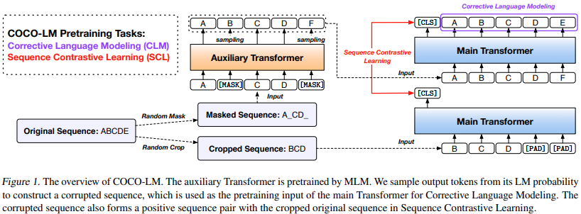

</img>

## COCO LM Pretraining (wip)

Implementation of <a href="https://arxiv.org/abs/2102.08473">COCO-LM</a>, Correcting and Contrasting Text Sequences for Language Model Pretraining, in Pytorch. They were able to make contrastive learning work in a self-supervised manner for language model pretraining. Seems like a solid successor to Electra.

## Install

```bash
$ pip install coco-lm-pytorch
```

## Usage

An example using the `x-transformers` library

```bash
$ pip install x-transformers
```
Then

```python
import torch
from torch import nn
from x_transformers import TransformerWrapper, Encoder

from coco_lm_pytorch import COCO

# (1) instantiate the generator and discriminator, making sure that the generator is roughly a quarter to a half of the size of the discriminator

generator = TransformerWrapper(
    num_tokens = 20000,
    emb_dim = 128,
    max_seq_len = 1024,
    attn_layers = Encoder(
        dim = 256,         # smaller hidden dimension
        heads = 4,         # less heads
        ff_mult = 2,       # smaller feedforward dimension
        depth = 1
    )
)

discriminator = TransformerWrapper(
    num_tokens = 20000,
    emb_dim = 128,
    max_seq_len = 1024,
    attn_layers = Encoder(
        dim = 1024,
        heads = 16,
        ff_mult = 4,
        depth = 12
    )
)

# (2) weight tie the token and positional embeddings of generator and discriminator

generator.token_emb = discriminator.token_emb
generator.pos_emb = discriminator.pos_emb

# weight tie any other embeddings if available, token type embeddings, etc.

# (3) instantiate COCO

trainer = COCO(
    generator,
    discriminator,
    discr_dim = 1024,            # the embedding dimension of the discriminator
    discr_layer = 'norm',        # the layer name in the discriminator, whose output would be used for predicting token is still the same or replaced
    cls_token_id = 1,            # a token id must be reserved for [CLS], which is prepended to the sequence for contrastive learning
    mask_token_id = 2,           # the token id reserved for masking
    pad_token_id = 0,            # the token id for padding
    mask_prob = 0.15,            # masking probability for masked language modeling
    mask_ignore_token_ids = [],  # ids of tokens to ignore for mask modeling ex. (cls, sep)
    cl_weight = 1.,              # weight for the contrastive learning loss
    disc_weight = 1.,            # weight for the corrective learning loss
    gen_weight = 1.              # weight for the MLM loss
)

# (4) train

data = torch.randint(0, 20000, (1, 1024))

loss = trainer(data)
loss.backward()

# after much training, the discriminator should have improved

torch.save(discriminator, f'./pretrained-model.pt')
```

## Citations

```bibtex
@misc{meng2021cocolm,
    title   = {COCO-LM: Correcting and Contrasting Text Sequences for Language Model Pretraining}, 
    author  = {Yu Meng and Chenyan Xiong and Payal Bajaj and Saurabh Tiwary and Paul Bennett and Jiawei Han and Xia Song},
    year    = {2021},
    eprint  = {2102.08473},
    archivePrefix = {arXiv},
    primaryClass = {cs.CL}
}
```
